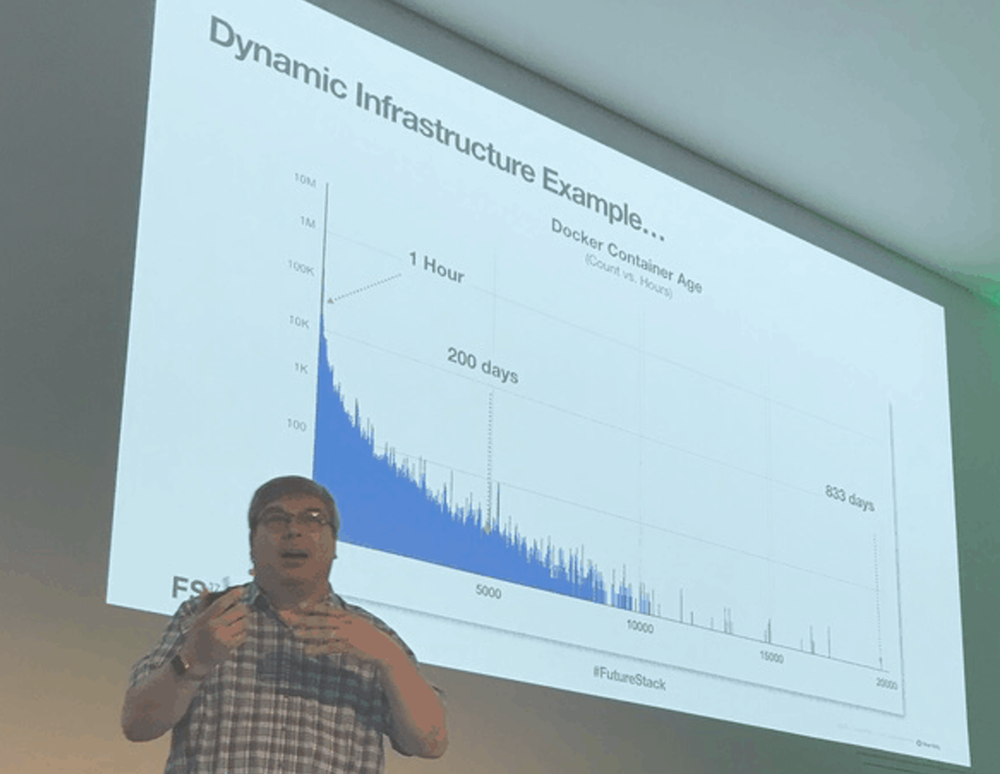

Lee Atchison is a recognized industry thought leader in cloud computing.

Lee has 33 years of industry experience including seven years as a Senior Manager at Amazon.com and eight years as a Senior Director at New Relic. At Amazon, he led the creation of the company’s first software download store, created AWS Elastic Beanstalk, and managed the migration of Amazon’s retail platform to a new service-based architecture. At New Relic, he helped build a solid service-based product architecture that scaled from startup to high traffic public enterprise.

Lee has consulted with leading organizations on how to modernize their application architectures and transform their organizations at scale; including optimizing for cloud platforms, utilize service-based architectures, implement DevOps practices, and design for high availability. This experience led him to write his book “Architecting for Scale”, published in 2016 by O’Reilly Media. The second edition of this book was released in 2020.

Lee is an industry expert and is widely quoted in publications such as InfoWorld, Diginomica, IT Brief, Programmable Web, CIO Review, and DZone. He has been a featured speaker at events across the globe from London to Sydney, Tokyo to Paris, and all over North America.

## Learn More About Lee

Click on the following links for more information about Lee:

* <a href="https://leeatchison.com" target="_blank">Lee's articles and publications</a>
* <a href="https://architectingforscale.com" target="_blank">Architecting for Scale, published by O'Reilly Media</a>
* Podcast: <a href="https://mdacast.com" target="_blank">"Modern Digital Applications with Lee Atchison"</a>